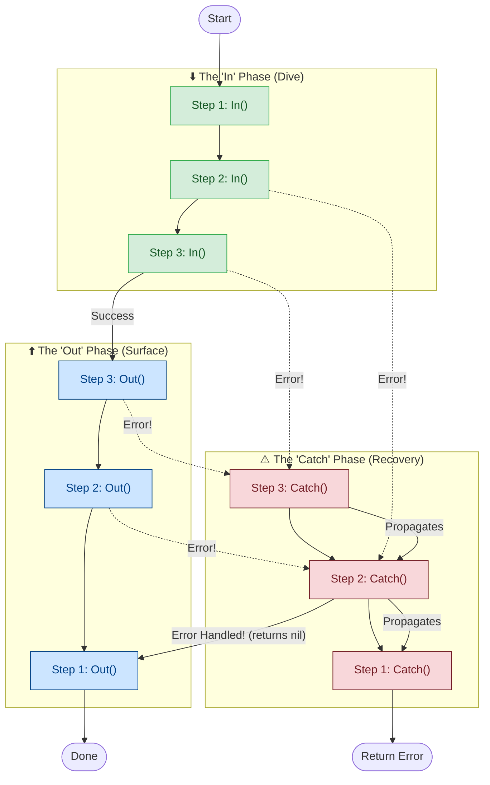

<p align="center">
  
</p>

# uflow ── Type-Safe, 3-Phase U-Shape Workflow Engine for Go

[](https://pkg.go.dev/github.com/nedcg/uflow)
[](https://goreportcard.com/report/github.com/nedcg/uflow)

**uflow** is an elegant, generic workflow engine written in Go. Instead of executing logic in a simple straight line, uflow implements a **U-Shape Execution Model** (often known as the Onion or Step pattern, popularized by Clojure's Pedestal framework).

It enables you to coordinate complex, multi-stage middleware flows on top of any arbitrary state struct in a completely type-safe manner. 

uflow is designed for building middleware-heavy HTTP applications, event processing systems (Kafka/RabbitMQ), and transaction coordinator chains where state separation, guaranteed cleanup, and dynamic scheduling are critical.

---

## 🌊 The U-Shape Execution Model

Think of execution like a dive into a pool: you dive **In** (descending through your steps), hit the bottom, and then travel back **Out** (ascending through those exact same steps in reverse).

If something goes wrong at any point, the pipeline immediately halts and begins moving upwards through the **Catch** phase, allowing outer steps to gracefully recover or rollback.



1. **In Phase (Forward / FIFO):** Executes `In` hooks sequentially down the queue. Each executed step is pushed onto a LIFO execution stack.
2. **Out Phase (Reverse / LIFO):** Once all `In` hooks succeed, uflow pops steps from the stack one by one, executing their `Out` hooks in reverse order.
3. **Catch Phase (Reverse / LIFO):** If an error occurs in any `In` or `Out` hook, execution immediately switches to the `Catch` phase. Steps are popped from the stack, routing the error backward through their `Catch` hooks.
    *   **Recovery:** If a `Catch` hook handles the error and returns `nil`, the pipeline *recovers*. It safely resumes the `Out` phase for all remaining steps left on the stack.

---

## 🚀 Installation

```bash
go get github.com/nedcg/uflow
```

---

## 🧩 Building Pipelines (Step-by-Step)

uflow revolves around the `Step[T]` interface, but provides incredibly ergonomic wrappers to define logic exactly where you need it.

### 1. In-Only Steps
Perfect for pre-processing, validation, or authentication.
```go
authStep := uflow.In("Auth", func(r *uflow.Runner[*Context]) error {
    if r.Data.Token == "" {
        return errors.New("unauthorized")
    }
    return nil
})
```

### 2. Out-Only Steps
Perfect for post-processing, auditing, or cleanup that must happen *after* everything else has run.
```go
auditStep := uflow.Out("Audit", func(r *uflow.Runner[*Context]) error {
    fmt.Println("Pipeline finished with status:", r.Data.Status)
    return nil
})
```

### 3. Group (Pipeline Flattening)
You can bundle multiple steps into a reusable module using `uflow.Group`. 

Groups are natively flattened by the `Runner`. This guarantees the U-shape "onion" ordering is perfectly preserved across boundaries.

```go
// Group multiple steps into a cohesive block
securityModule := uflow.NewGroup(
    rateLimitStep,
    authStep,
    corsStep,
)

// You can nest Groups inside other Groups infinitely
mainFlow := uflow.NewGroup(
    auditStep,
    securityModule, // Flattens seamlessly
    businessLogicStep,
)
```

### 4. Nested Isolation (`NestedIn` / `NestedOut`)
Sometimes you *don't* want to flatten steps. If you want an entire sub-pipeline to execute from start-to-finish entirely within the parent's `In` or `Out` phase, use `NestedIn`.

```go
isolatedTx := uflow.NestedIn("TxBlock", 
    uflow.In("BeginTx", begin),
    uflow.Out("CommitTx", commit),
    uflow.Catch("RollbackTx", rollback),
)

// The parent pipeline will pause at `isolatedTx`, wait for the entire 
// Begin -> Commit/Rollback sub-execution to finish, and then continue.
```

### 5. Short-Circuiting (`Terminate`)
If a step decides that no further downstream processing is needed (e.g., returning a cached HTTP response), it can call `Terminate()`.

```go
cacheStep := uflow.In("CacheCheck", func(r *uflow.Runner[*Context]) error {
    if cached := getCache(r.Data.Request); cached != nil {
        r.Data.Response = cached
        
        // Stops any deeper 'In' hooks from running.
        // Execution immediately turns around and begins the 'Out' phase!
        r.Terminate() 
    }
    return nil
})
```

---

## 💡 Real-World Applications

### 🌐 HTTP Middleware (Tracing & Telemetry)
The U-Shape is the ultimate pattern for HTTP requests. You can inject a Trace ID on the way `In`, and calculate total response duration on the way `Out`.

```go
type RequestState struct {
    Req       *http.Request
    Res       http.ResponseWriter
    StartTime time.Time
}

telemetryStep := &uflow.StepFunc[*RequestState]{
    Id: "Telemetry",
    InFunc: func(r *uflow.Runner[*RequestState]) error {
        r.Data.StartTime = time.Now()
        r.Data.Req.Header.Set("X-Trace-ID", generateUUID())
        return nil
    },
    OutFunc: func(r *uflow.Runner[*RequestState]) error {
        duration := time.Since(r.Data.StartTime)
        log.Printf("Request completed in %v", duration)
        return nil
    },
}
```

### 📩 Kafka Consumers & Producers
When processing event streams, you want to guarantee that a message is acknowledged *only* if the pipeline succeeds, and DLQ'd (Dead-Letter Queue) if it fails.

```go
kafkaAckStep := &uflow.StepFunc[*MessageState]{
    Id: "KafkaAck",
    // Ack the message on the way OUT (Success)
    OutFunc: func(r *uflow.Runner[*MessageState]) error {
        r.Data.Message.Ack()
        return nil
    },
    // Nack or DLQ the message on CATCH (Failure)
    CatchFunc: func(r *uflow.Runner[*MessageState], err error) error {
        sendToDLQ(r.Data.Message, err)
        r.Data.Message.Nack()
        
        // Return nil to tell uflow we've handled the error gracefully!
        return nil 
    },
}
```

### 🪵 Log Configuration (Context Enrichment)
You can inject a highly-contextual logger into the pipeline state, use it deep within your business logic, and effortlessly tear it down or sync it at the end.

```go
loggingStep := &uflow.StepFunc[*AppState]{
    Id: "Logger",
    InFunc: func(r *uflow.Runner[*AppState]) error {
        // Create a scoped logger
        r.Data.Logger = baseLogger.With("trace", r.Data.TraceID)
        return nil
    },
    OutFunc: func(r *uflow.Runner[*AppState]) error {
        // Guarantee logs are flushed to disk before the pipeline fully exits
        r.Data.Logger.Sync()
        return nil
    },
}
```

---

## ⚡ Memory Reuse & Pooling (Zero Allocation)

For high-throughput systems (such as consuming millions of events per second), allocation overhead can be a bottleneck. 

uflow's `Runner[T]` can be pooled using standard `sync.Pool` by resetting its state in-place:

```go
var runnerPool = sync.Pool{
	New: func() any {
		return &uflow.Runner[*MyState]{}
	},
}

func ProcessEvent(ctx context.Context, flow uflow.Step[*MyState], data *MyState) error {
	// 1. Get runner from pool
	r := runnerPool.Get().(*uflow.Runner[*MyState])
	
	// 2. Reset in-place (Flattens the flow automatically)
	r.Reset(ctx, []uflow.Step[*MyState]{flow}, data)
	
	// 3. Run execution
	err := r.Execute()
	
	// 4. Put back to pool
	runnerPool.Put(r)
	return err
}
```

---

## License

Licensed under the MIT License. See [LICENSE](LICENSE) for details.
