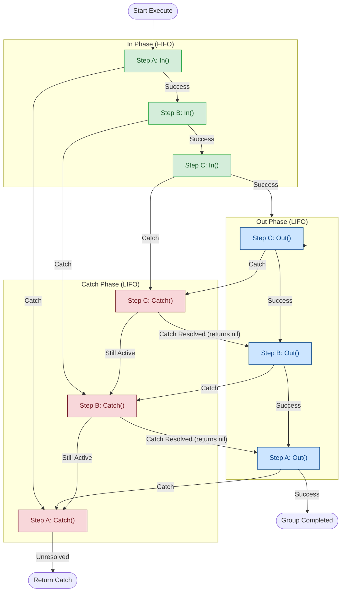

<p align="center">
  
</p>

# uflow ── Type-Safe, 3-Phase Step Group Engine for Go

[](https://pkg.go.dev/github.com/nedcg/uflow)
[](https://goreportcard.com/report/github.com/nedcg/uflow)

**uflow** is an elegant, generic group engine written in Go. Inspired by the **Step Pattern** (famously used in Clojure's Pedestal framework), uflow enables you to coordinate complex, multi-stage workflows on top of any arbitrary state struct in a type-safe manner.

uflow is designed for building middleware-heavy applications, event processing systems, data-ingestion pipelines, and transaction coordinator chains where state separation, error propagation/recovery, and dynamic scheduling are critical.

---

## Key Features

*   **100% Type-Safe (Go Generics):** Operates on any custom state type `T` via `Runner[T]`, eliminating `interface{}` cast overhead and type-assertions.
*   **Three-Phase Step Lifecycle:** Every step implements three distinct phases: `In` (FIFO), `Out` (LIFO), and `Catch` (LIFO).
*   **Catch Recovery & Resolution:** Steps can catch, modify, propagate, or completely suppress (resolve) errors. Resolving an error resumes the `Out` execution phase down the remaining stack.
*   **Dynamic Queue Control:** Steps can append new stages mid-flight via `Enqueue` or halt downstream stages entirely via `Terminate`.
*   **Context-Aware Runner:** Built-in checks for `context.Context` cancellation or deadline expiration between stages.
*   **High Performance / Zero Allocations:** Includes an in-place `Reset` method allowing `Runner[T]` structures to be pooled using `sync.Pool` to avoid memory allocations in high-throughput pipelines.

---

## The 3-Phase Runner Lifecycle

uflow runs execution pipelines in a stack-based double-pass traversal:



1.  **In Phase (Forward / FIFO):** Executes `In` hooks sequentially down the queue. Each executed step is pushed onto a LIFO execution stack.
2.  **Out Phase (Reverse / LIFO):** Once all `In` hooks succeed, uflow pops steps from the stack one by one, executing their `Out` hooks in reverse order.
3.  **Catch Phase (Reverse / LIFO):** If an error occurs in any `In` or `Out` hook (or if the `context.Context` is cancelled), execution immediately halts. uflow pops steps from the stack, routing the error through their `Catch` hooks.
    *   **Catch Recovery:** If an `Catch` hook handles/suppresses the error by returning `nil`, the group recovers! It halts the error propagation and resumes executing the `Out` phase for all remaining steps left on the stack.

---

## Installation

```bash
go get github.com/nedcg/uflow
```

---

## Core Interfaces & Structs

### 1. The Step Interface

An step represents a single processing module. You can implement the interface directly:

```go
type Step[T any] interface {
	Name() string
	In(exec *Runner[T]) error
	Out(exec *Runner[T]) error
	Catch(exec *Runner[T], err error) error
}
```

Or you can use `uflow.Func[T]` or helper functions (`uflow.In`, `uflow.Out`, `uflow.Error`) to create ad-hoc steps.

### 2. Runner State Manager

The `Runner[T]` struct maintains the execution state, the group queue, and your custom mutable data `T`:

```go
type Runner[T any] struct {
	Data T // Your custom state
    // private fields...
}
```

---

## Usage Examples

### Example 1: Basic Group

In this example, we process a HTTP-like request context, modifying the request headers in `In` and logging/auditing the status in `Out`.

```go
package main

import (
	"context"
	"fmt"
	"github.com/nedcg/uflow"
)

// Define your group state
type RequestState struct {
	Headers map[string]string
	Body    string
	Status  int
}

func main() {
	// 1. Create steps
	authStep := uflow.In("Auth", func(e *uflow.Runner[*RequestState]) error {
		if e.Data.Headers["Authorization"] == "" {
			e.Data.Status = 401
			e.Terminate() // Halt downstream group execution
		}
		return nil
	})

	businessLogic := uflow.In("Process", func(e *uflow.Runner[*RequestState]) error {
		fmt.Println("Processing payload:", e.Data.Body)
		e.Data.Status = 200
		return nil
	})

	auditLogger := uflow.Out("AuditLog", func(e *uflow.Runner[*RequestState]) error {
		fmt.Printf("[AuditLog] Handled request with status: %d\n", e.Data.Status)
		return nil
	})

	// 2. Assemble the queue
	group := []uflow.Step[*RequestState]{
		auditLogger, // In: skipped (has no In hook), Out: runs last
		authStep,
		businessLogic,
	}

	// 3. Prepare state and run execution
	state := &RequestState{
		Headers: map[string]string{"Authorization": "Bearer token123"},
		Body:    `{"userID": "12345"}`,
	}

	exec := uflow.NewRunner(context.Background(), group, state)
	if err := exec.Execute(); err != nil {
		fmt.Printf("Group failed: %v\n", err)
	}
}
```

### Example 2: Catch Recovery

uflow makes error recovery simple. Any stage's `Catch` hook can catch a downstream failure and resolve it:

```go
recoveryStep := &uflow.Func[MyState]{
	Id: "Recovery",
	CatchFunc: func(exec *uflow.Runner[MyState], err error) error {
		fmt.Printf("Caught downstream error: %v. Recovering...\n", err)
		// Perform recovery actions...
		return nil // Returning nil marks the error as resolved!
	},
}
```

If a downstream step fails, `Recovery.Error()` intercepts the error. Because it returns `nil`, uflow will resume running the `Out` hooks of all upstream steps on the stack.

### Example 3: Dynamic Scheduling

Steps can add steps to the queue dynamically based on runtime conditions:

```go
injector := uflow.In("DynamicStep", func(e *uflow.Runner[*MyState]) error {
	if e.Data.NeedsCompacting {
		// Enqueue the compaction step to run right after this hook finishes
		e.Enqueue(compactionStep)
	}
	return nil
})
```

---

## Memory Reuse & Pooling (Zero Allocation)

For high-throughput systems (such as Kafka consumer loops processing millions of events per second), allocation overhead can be a bottleneck. 

uflow's `Runner[T]` can be pooled using `sync.Pool` by resetting its state in-place:

```go
var executionPool = sync.Pool{
	New: func() any {
		return &uflow.Runner[MyState]{}
	},
}

func HandleBatch(ctx context.Context, group []uflow.Step[MyState], data MyState) error {
	// 1. Get execution manager from pool
	exec := executionPool.Get().(*uflow.Runner[MyState])
	
	// 2. Reset in-place
	exec.Reset(ctx, group, data)
	
	// 3. Run execution
	err := exec.Execute()
	
	// 4. Put back to pool
	executionPool.Put(exec)
	return err
}
```

---

## License

Licensed under the MIT License. See [LICENSE](LICENSE) for details.
